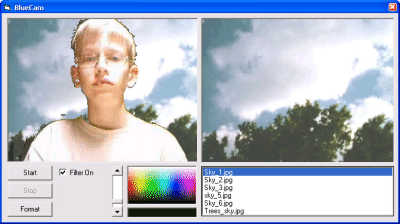



## BlueCam

### Description

Blue Screen program - This is a program that replaces a selectable color with a background.

IN REAL TIME!

Hook up your Webcam stand in front of your solid-colored wall, and click on the wall. Then move the slider to adjust the sensivity.

Let me know what you think.
 
### More Info
 

             |
---                |---
**Submitted On**   |2003-07-01 16:13:10
**By**             |[Marshall H\.](https://github.com/Planet-Source-Code/PSCIndex/blob/master/ByAuthor/marshall-h.md)
**Level**          |Intermediate
**User Rating**    |4.1 (58 globes from 14 users)
**Compatibility**  |VB 5\.0, VB 6\.0
**Category**       |[Graphics](https://github.com/Planet-Source-Code/PSCIndex/blob/master/ByCategory/graphics__1-46.md)
**World**          |[Visual Basic](https://github.com/Planet-Source-Code/PSCIndex/blob/master/ByWorld/visual-basic.md)
**Archive File**   |[BlueCam160843712003\.zip](https://github.com/Planet-Source-Code/marshall-h-bluecam__1-46581/archive/master.zip)

